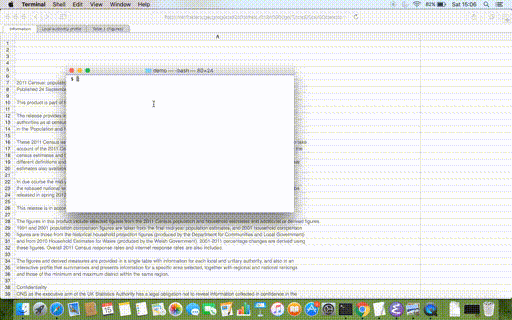
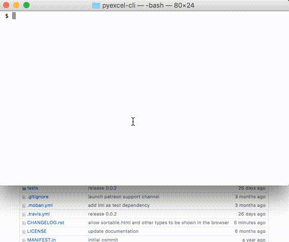

View your excel files without any additional software
================================================================================

Suppose you have an `census file <https://github.com/pyexcel/pyexcel-handsontable/raw/master/demo/census.xls>`_  and you would like to view it graphically but you do
not have Microsoft Excel, Apple Numbers nor Open Office with you. Luckily, you
have Python and pyexcel. Here is what you can do::

    $ pyexcel view --in-browser https://github.com/pyexcel/pyexcel-handsontable/raw/master/demo/census.xls

Suppose you have an `google stock price <https://github.com/pyexcel/excel2table/raw/master/sample/goog.ods>`_  and you wanted to view but also sort them. Here is what you can do::

    $ pyexcel view --in-browser --output-file-type sortable.html --sheet-index 0 https://github.com/pyexcel/excel2table/raw/master/sample/goog.ods

